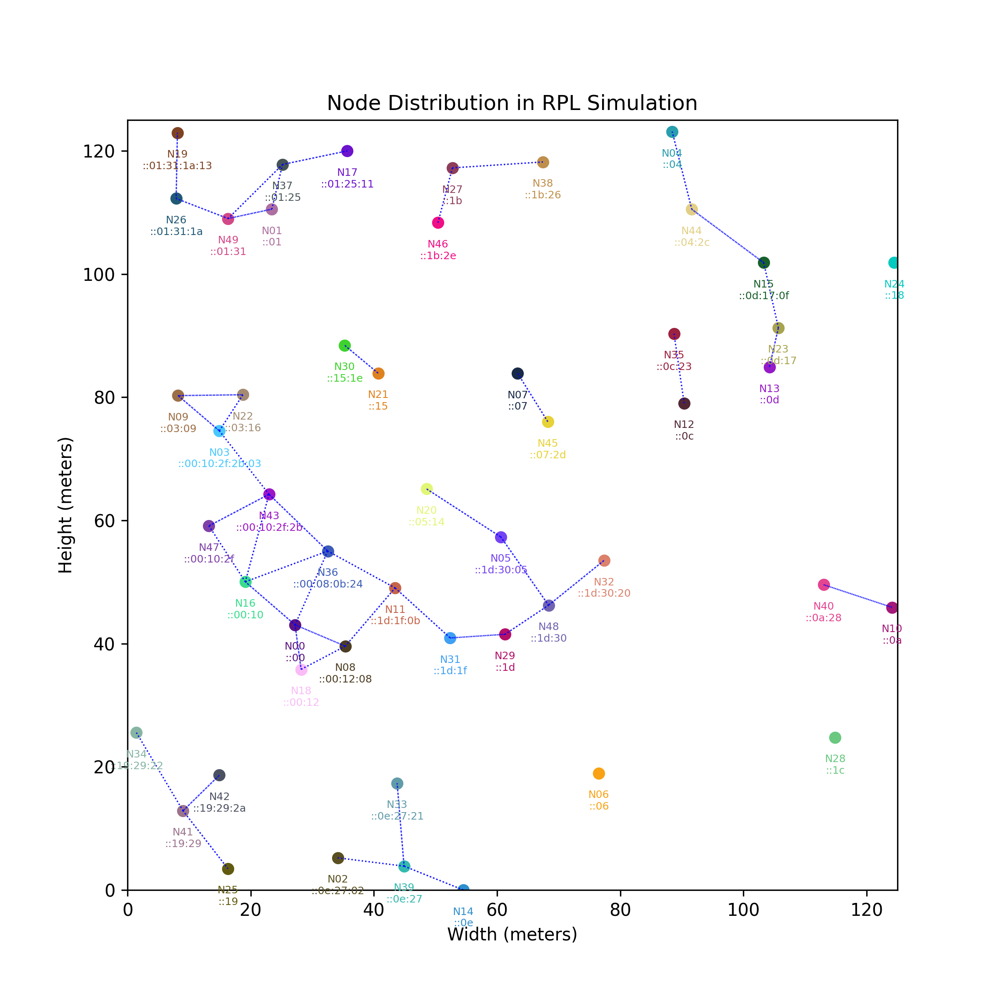

# RPL Simulation

This repository contains the Python code for simulating the Routing over Low Power and Lossy Networks (RPL) protocol. The simulation uses SimPy, a discrete-event simulation framework, to model the behavior of nodes within a low-power lossy network, specifically focusing on the dynamics of RPL's routing mechanisms.

## Features

- **Neighbor Discovery**: Nodes dynamically discover neighbors based on a specified connection range.
- **DODAG Formation**: Implements the RPL's DODAG (Directed Acyclic Graph) formation using DIO (DODAG Information Object) messages.
- **Prefix Distribution**: Utilizes DAO (Destination Advertisement Object) messages for the distribution of network prefixes.
- **Trickle Algorithm**: Controls the timing of DIS (DODAG Information Solicitation) messages to optimize network traffic.
- **Network Disruptions**: Simulates network disruptions and node recovery to test the robustness of the network.

## Requirements

- Python 3.6 or higher
- SimPy
- Matplotlib

## Installation

### Clone the repository:
```bash
git clone https://github.com/arman-bd/rpl-simulation.git
```

### Install the required packages:
```bash
pip install simpy matplotlib
```

## Configuration
Modify the simulation parameters in `simulation.py` according to your needs. You can modify default values directly in code or when launching the script.

- **RANDOM_SEED**: Random seed for reproducibility.
- **NUM_NODES**: Number of nodes in the simulation.
- **AREA_WIDTH, AREA_HEIGHT**: Dimensions of the simulation area.
- **CONNECTION_RANGE**: Maximum range for connecting to other nodes.
- **DIO_INTERVAL**: Interval at which DIO messages are sent.
- **NODE_CREATION_INTERVAL**: Interval at which nodes are created in the simulation.
- **RUNTIME**: Duration of the simulation.

## Usage

To run the simulation, execute the script `simulation.py`:

```bash
python simulation.py
```

The simulation will generate a plot showing the node distribution and the DODAG connections. Additionally, diagnostic outputs including node creation, neighbor discovery, and message exchanges are printed to the console and saved to a file named output.txt.

## Visualization
The generated plot will illustrate nodes as points on a grid with lines connecting them to represent parent-child relationships in the DODAG. Each node's ID and the IPv6 prefix are displayed next to the corresponding node on the plot.

## Output
* A PNG image of the node distribution and connections named output.png.
* A detailed log of the simulation process saved to output.txt, including timestamped events such as DIS and DIO message exchanges, and DAO message propagation.

### Sample Output:



```text
0.00 Node00 created at (103.3963, 26.5954)
0.00 Node00 starting neighbor discovery
1.00 Node01 created at (21.2037, 24.2015)
1.00 Node01 starting neighbor discovery
1.00 Node00 sends DIS broadcast for neighbor discovery
2.00 Node02 created at (27.5986, 89.5239)
2.00 Node02 starting neighbor discovery
2.00 Node01 sends DIS broadcast for neighbor discovery
2.28 Node00 sends DIS broadcast for neighbor discovery
3.00 Node03 created at (108.8647, 95.1618)
3.00 Node03 starting neighbor discovery
3.00 Node02 sends DIS broadcast for neighbor discovery
3.57 Node01 sends DIS broadcast for neighbor discovery
4.00 Node04 created at (78.3705, 118.4513)
4.00 Node04 starting neighbor discovery
4.00 Node03 sends DIS broadcast for neighbor discovery
4.50 Node00 sends DIS broadcast for neighbor discovery
4.64 Node01 sends DIS broadcast for neighbor discovery
4.94 Node02 sends DIS broadcast for neighbor discovery
5.00 Node05 created at (21.0677, 121.0056)
5.00 Node05 starting neighbor discovery
5.00 Node04 sends DIS broadcast for neighbor discovery
5.11 Node03 sends DIS broadcast for neighbor discovery
6.00 Node06 created at (85.9161, 59.6546)
6.00 Node06 starting neighbor discovery
...
...
```
<a href="output.txt">Output</a>

## Documentation
**TBD**

## Authors
[Arman](https://github.com/arman-bd) and Team

## License
This project is licensed under the [MIT License](LICENSE).

## Acknowledgments
[Aarhus University](https://au.dk) - For providing the academic environment and guidance necessary for this project.